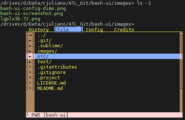
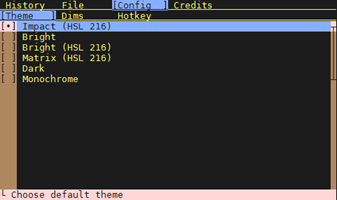
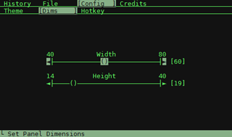
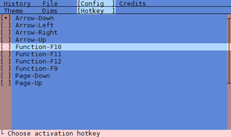
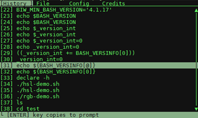
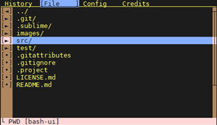

# BASH-UI - Bash User Interface

This program provides an interactive pop-up UI within the Bash shell and is written entirely in Bash. Currently it provides a convenient way of browsing history and files which are appended to the prompt. 



## Table of Contents

- [Features](#features)
- [Quick Start](#quick-start)
- [Prerequisites](#prerequisites)
- [Walkthrough](#walkthrough)
	- [Configuration](#configuration)
	- [Bash History](#bash-history)
	- [File Browser](#file-browser)
	- [Credits](#credits)
- [FAQ](#faq)
- [Issues](#issues)
- [Author](#author)
- [License](#license)

## Features

* **Minimal dependencies:** Requires only a relatively dated version of Bash (4.1.17) and a commonly available terminal (e.g. PuTTY).
* **Intuative UI:** Scrollable browsing and selection of the filesystem and Bash history.
* **Simple configuration:** UI based configuration of the color theme, panel dimensions, and hotkey.
* **Powerful terminal graphics:** Supports UTF8 graphic characters, 256 color display, calculations in the HSL colorspace, and animations with color gradients.

## Quick Start

The below steps will help you quickly install and start the program.

1. Confirm that you have a supported terminal and Bash version as indicated in [Prerequisites](#prerequisites).
1. Extract the the contents of the [distribution zip][ZIP_FILE] file.
1. Modify the .bashrc and add a line to source the **bui-setup.sh** script. You may need to modify the path in the below example.
```sh
source ~/bash-ui/src/bui-setup.sh
``` 
1. Re-start your Bash session.
1. At the prompt hit the down arrow key (this is the default hotkey).
1. You should see a panel with your Bash history like in the above screenshot. At this point you can proceed to the [Walkthrough](#walkthrough) section.

[ZIP_FILE]: <https://github.com/chadj2/bash-ui/archive/master.zip>

## Prerequisites

#### Minimum Features:

* Bash version 4.1.17 or later.
* Terminal must be capable of and configured for:
	* 256 color xterm support or better
	* UTF-8 graphic characters (default characters supported by PuTTY are acceptable)

#### Supported Terminals:

* MobaXterm v8.6 or higher
* PuTTY v0.67 or higher: should be configured with Unicode and 256 color support.
	* In **Window->Translation** select **Use Unicode line drawling code points**.
	* In **Window->Colours** select **Allow terminal to use xterm 256-colour mode**.

## Walkthrough

This section assumes that you have a running version of Bash-UI. Invoke the hotkey (default is down arrow) to launch the panel.

### Configuration

Use the right arrow to navigate to highlight the config option in the menu bar. Use the down arrow to navigate to one of the 3 configuration menus. 

The config menus are used to edit the configuration file located at **$HOME/.bui_settings**.

* **Theme:** Allows you to change the color scheme of the interface. 256-color themes are indicated with *HSL 216*. Arrow keys preview the theme and Enter or Space saves. 

	

* **Dimensions:** Allows you to change the dimensions of the panel. Hit the down arrow to highlight one of the sliders. Use the left and right arrows to adjust and enter to save.

	

* **Hotkey:** Allows you to change the activation hotkey (default is down arrow). The change will be effective when the program exits. Use the arrow keys to navigate and Enter or Space to save.

	

### Bash History

The Bash history screen allows you to browse previous commands and copy them to the prompt. Use the arrow keys to highlight a command. When you hit enter the application will exit and append the command to the existing prompt.



### File Browser

The file browser screen allows you to graphically navigate the filesystem. When you select a file its relative path will be appended to the existing prompt. Use the up and down arrow keys to navigate and hit enter to select.



### Credits

**Warning:** The credits panel will eat your CPU but there are some fun animations.

## FAQ

#### Why is this utility needed when there are existing key sequences to accomplish the same tasks?

Some people prefer to be lazy and not memorize key sequences. Also, a scrollable and selectable view of content can be as fast or faster for simple tasks.

#### Why was this program not written in a more powerful language like Python?

Many corporate environments can be very restrictive and it is not always possible or worth the effort to install complex dependencies. One objective of this tool is that it be easy to run everywhere.

#### Why does the program send ESC terminal commands directly instead of through the curses interface?

Using curses with a program like tput would be far too slow. For example a static panel needs to be rendered sub-second and can require dozens of terminal control sequences. This would not be possible without calls to integrated shell functions.

#### What other enhancements are planned? 

There are plans for a screen that would allow the user to select the primary termal foreground and background in the HSL colorspace. This would help with default ANSI colors that are harsh and ugly. Other suggestions are appreciated.

#### How can I use this code to build other applications and graphics demos?

Other enhancements are planned that will provide simple examples of how to use the scripts as an external API.

#### How does the sinusoid effect in the Credits panel work?

A simulation of 2 pendulums for the X and Y axis is computed and the output is written to a temporary "alpha" buffer. For each frame the alpha sprite will read values from this buffer, map its value to a colormap, print the color, and decrement the value.

#### Why did you write this?

Bash is an interface used daily by hundreds of thousands of developers and engineers and I did not see good examples of UI integration that were easily accessible. It was an experiment to push the limits of the console interface to understand what is possible and see how it could enhance the daily experience. 

The Bash language has a lot of limitations (e.g. poor performance, no floating point math, no HSL colorspace, and no variable references or UTF-8 support until more recent versions) and there were few examples to start with. Working around this took some inventing but it was a fun challenge.

## Issues

* When a hotkey is modified in the configuration panel the old binding is not immediately restored upon exit. Restarting the Bash session will correct this.

* The CTRL-C or kill signal is not always handled properly while viewing the animation on the credits panel due to a Bash bug. This can leave the terminal in a bad state. Restarting the Bash session will correct this.

## Author

- [Chad Juliano](https://github.com/chadj2)

## License

This program is licensed under [GNU Lesser General Public License v3.0 only][LGPL-3.0].
Some rights reserved. See [LICENSE][].

[  ][LGPL-3.0]

[LGPL-3.0]: <https://spdx.org/licenses/LGPL-3.0>
[LICENSE]: <LICENSE.md>
